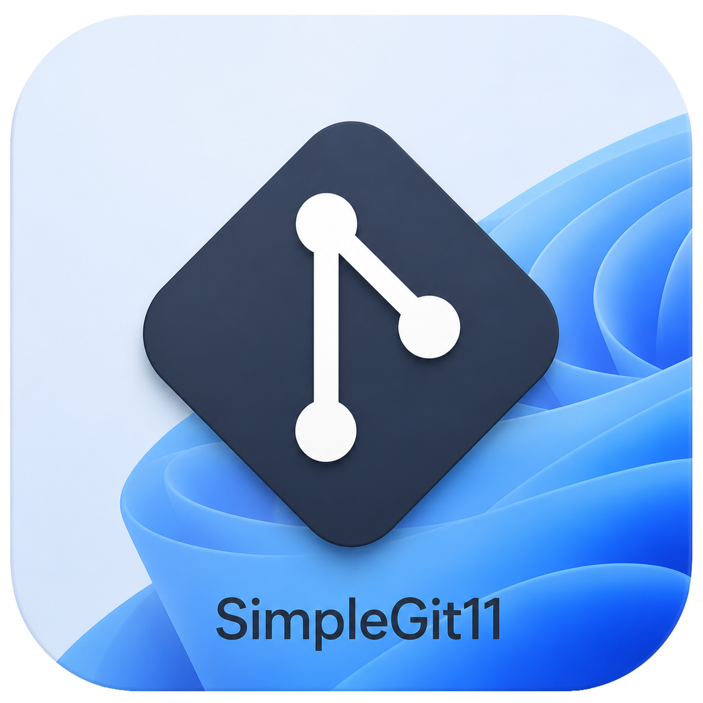
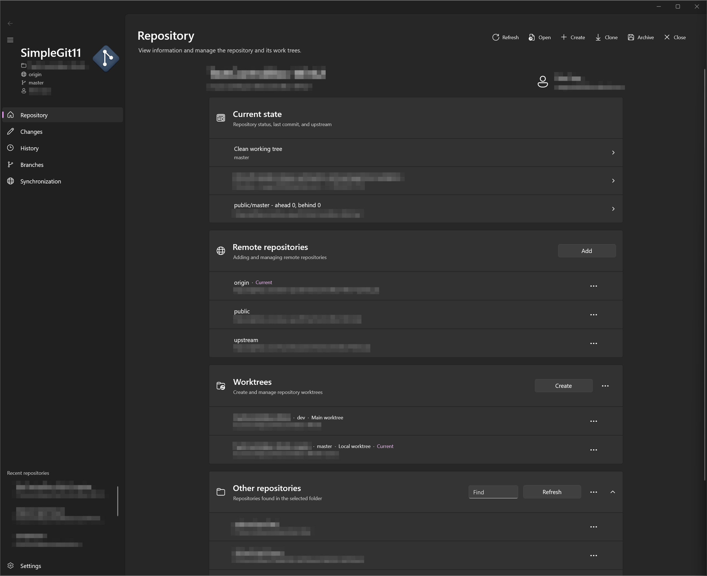

<p align="center">
  <a href="README.md">English</a> | <a href="README.ru.md">Русский</a>
</p>

<p align="center">
  
</p>

<h1 align="center">SimpleGit11</h1>

<p align="center">
  A graphical Git client for Windows 11, built with WinUI 3
</p>

SimpleGit11 is a graphical client for the installed `git.exe`, designed to
look and feel at home on Windows 11. It provides a visual interface for
day-to-day work with local and remote repositories while relying on Git itself
to perform every repository operation.

> [!IMPORTANT]
> SimpleGit11 is currently a preview. The interface, behavior, and settings
> format may change before the stable 1.0 release.



## Features

- **Repositories:** open, create, and clone repositories; search for
  repositories inside a selected folder; access recent repositories; inspect
  repository status, the current branch, upstream, and Git user information.
- **Changes and commits:** browse staged, unstaged, untracked, and conflicted
  files; view a highlighted diff or the full file; stage or unstage individual
  files and all changes; revert lines or files; edit files in the app; create
  commits and amend the latest commit.
- **In-progress operations and stashes:** continue, skip, or abort merge,
  rebase, cherry-pick, and revert operations; create, apply, pop, and delete
  stashes.
- **History:** browse paged commit history and commit contents, compare
  revisions, revert a commit, and perform soft, mixed, or hard resets.
- **Branches and tags:** work with local and remote branches, lightweight tags,
  and annotated tags; create, rename, delete, and check out references;
  configure upstream and push remotes; merge, squash merge, or rebase; compare
  branches and inspect branch reflog.
- **Remotes and synchronization:** add, rename, edit, and remove remotes;
  fetch, pull, and push; push individual branches or tags, all pending changes,
  or use atomic push; inspect incoming and outgoing changes.
- **Worktrees:** create, open, move, lock, unlock, and remove worktrees, with
  prune and repair operations available from the interface.
- **Conflict resolution:** use the built-in editor to accept the current,
  incoming, or both versions; edit individual lines; undo and redo changes; and
  mark the file as resolved.
- **Additional tools:** archive a selected revision as ZIP, TAR.GZ, or TAR;
  automatically refresh after external repository changes; configure Git user,
  email, default branch, push remote, and credential helper.
- **Windows 11 interface:** system, light, and dark themes; English and Russian
  localization; configurable editor font, size, and line spacing; window-level
  progress and error notifications that remain visible while navigating.

## Requirements

- Windows 11 x64;
- Git for Windows, with `git.exe` available through `PATH`.

The ready-to-use build is distributed as an **unpackaged, self-contained,
win-x64** application. .NET and the Windows App SDK are included, so a separate
.NET Runtime, certificate installation, and administrator rights are not
required.

## Installation

1. Download `SimpleGit11-<version>-win-x64.zip` and its matching `.sha256` file
   from the repository's Releases page.
2. Optionally verify the checksum.
3. Extract the entire ZIP archive to a permanent folder.
4. Run `SimpleGit11.exe`.

Do not run the application directly from the ZIP archive: all distributed
files are required. Automatic updates are not implemented yet. See
[PUBLISHING.md](PUBLISHING.md) for detailed installation, update, and checksum
verification instructions.

## Building from source

.NET SDK 10, a compatible Windows SDK, and Git for Windows are required.

```powershell
dotnet restore .\SimpleGit11.slnx
dotnet build .\SimpleGit11.slnx -c Debug -p:Platform=x64
```

The project supports `x64` builds only. See [PUBLISHING.md](PUBLISHING.md) for
local build details and release ZIP preparation.

## Technology

- C# 13 and .NET 8;
- WinUI 3 and the Windows App SDK;
- CommunityToolkit.Mvvm;
- MVVM and Dependency Injection.

See [ARCHITECTURE.md](ARCHITECTURE.md) for the layer structure and dependency
rules.

## Documentation

- [Build, installation, and publishing](PUBLISHING.md)
- [Architecture](ARCHITECTURE.md)
- [Security policy](SECURITY.md)
- [Third-party notices](THIRD-PARTY-NOTICES.txt)

## License

SimpleGit11 is distributed under the [MIT License](LICENSE).
